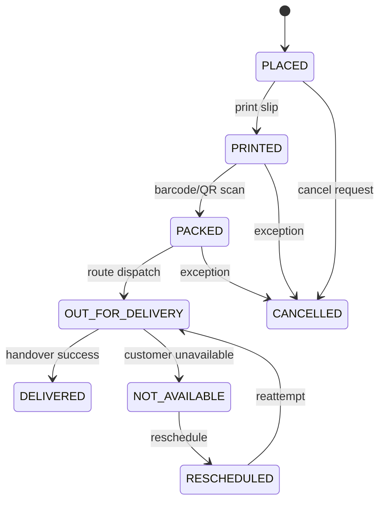

# Fresh Mandi Admin Panel - Production Blueprint

This blueprint maps your master prompt to an implementation-ready system for the existing Node.js backend and admin web panel, with Flutter Admin Web/Tablet as the primary client.

## 1) Admin UI Structure (Module Tree)

- Auth
  - Admin login
  - Role-aware landing redirects
- Dashboard
  - KPI cards
  - Sector/hourly/revenue/wastage/product graphs
- Orders
  - Date, sector, route, status filters
  - Nested tabs: Sector -> Building -> Route
  - Table: sequence, order, customer, flat, item summary, value, print/packing/delivery/payment
  - Status operations: placed -> printed -> packed -> out_for_delivery -> delivered/cancelled
- Order Cutoff (9 PM automation)
  - Freeze changes
  - Auto grouping (sector/building/route)
  - Purchase summary generation
  - Packing sheet generation
- Purchase Planning
  - Required qty + wastage + final purchase
  - Supplier and purchase tracking
  - PDF/Excel exports
- Inventory
  - GRN/goods received
  - Quality approval
  - Damage/wastage/adjustment
  - Low stock alerts
- Packing
  - Route sequence list
  - Item picking summary
  - Bulk barcode scan -> packed updates
  - Crate assignment
- Delivery Management
  - Delivery boy + route + crate assignment
  - Route start/end and pending tracking
  - Delivery outcomes and payment reconciliation
- Payments & Accounting
  - Daily collection
  - Sector-wise revenue
  - Settlement and partner share
  - Profit summary
- Customers
  - Profile/history/complaints/feedback
  - Block and credit adjustments
  - Manual order entry
- Products
  - Category/subcategory
  - Seasonal/out-of-season
  - Price/GST/stock visibility
- Routes
  - Route setup (sector/buildings/capacity/sequence)
  - Auto-assignment policy
- Reports
  - Daily/weekly/monthly/sector/wastage/packing/delivery reports
  - PDF/Excel exports
- Notifications
  - Order/delivery/payment/low stock/assignment alerts

## 2) Database Schema (Production)

Implemented and planned in [`backend/sql/schema.sql`](/Users/netfruxmac/Documents/New project/backend/sql/schema.sql):

- Existing core: `users`, `customers (via users + addresses)`, `orders`, `order_items`, `products`, `categories`, `payments`, `notifications`
- RBAC:
  - `roles`
  - `permissions`
  - `role_permissions`
  - `admin_user_roles`
- Ops structure:
  - `sectors`
  - `buildings`
  - `routes`
  - `route_buildings`
- Procurement/inventory/logging:
  - `purchase_summary`
  - `inventory`
  - `packing_log`
  - `delivery_log`
  - `reports`
- Enum-backed statuses:
  - `role_code`
  - `order_flow_status`
  - `delivery_status`
  - `payment_status`
- Audit fields:
  - `created_at`, `updated_at`, `updated_by` added on all new operational tables, plus major existing tables where practical.

## 3) API Endpoint Structure

Current admin API base: `/api/v1/admin`

- Auth/RBAC
  - `POST /auth/login`
  - `GET /me`
  - `GET /rbac/roles`
  - `GET /rbac/admin-users`
- Dashboard
  - `GET /dashboard`
- Products
  - `GET /products`
  - `POST /products`
  - `PUT /products/:id`
  - `DELETE /products/:id`
  - `POST /uploads`
- Orders
  - `GET /orders`
  - `GET /orders/:id`
  - `PATCH /orders/:id/status`
- Settings/Automations
  - `GET /settings`
  - `PUT /settings`
  - `POST /jobs/night-reminder`

Recommended next endpoints to complete full prompt:

- Procurement:
  - `GET /purchase-planning?date=YYYY-MM-DD`
  - `POST /purchase-planning/generate`
  - `PATCH /purchase-planning/:id/mark-purchased`
  - `GET /purchase-planning/export?format=pdf|xlsx`
- Inventory:
  - `POST /inventory/receipt`
  - `POST /inventory/quality-check`
  - `POST /inventory/adjustment`
  - `GET /inventory/low-stock`
- Packing:
  - `GET /packing/routes/:routeId`
  - `POST /packing/scan`
  - `POST /packing/scan/bulk`
  - `POST /packing/routes/:routeId/crates`
- Delivery:
  - `POST /delivery/assign`
  - `POST /delivery/route/:routeId/start`
  - `POST /delivery/route/:routeId/end`
  - `PATCH /delivery/orders/:orderId/status`
- Reports:
  - `GET /reports/:type?from=...&to=...`
  - `GET /reports/:type/export?format=pdf|xlsx`

## 4) Workflow Logic

Night cutoff workflow (`21:00` local timezone):

1. Lock order edits for same-day service.
2. Group pending orders by sector -> building -> route.
3. Auto-sequence by route sequence policy.
4. Generate `purchase_summary` from `order_items`.
5. Add wastage percent to final purchase quantity.
6. Generate route-wise packing sheets and queue print jobs.

Packing workflow:

1. Picker opens route queue.
2. Scans barcode/QR per order crate.
3. System writes `packing_log`, updates `orders.packing_status = PACKED`, `packed_at`, `updated_by`.
4. Bulk scan supports high-volume waves.

Delivery workflow:

1. Assign delivery staff + crate + route.
2. Mark route start and completion timestamps.
3. Update per-order delivery status.
4. Collect payment mode and settlement status.
5. Auto-post payment updates back to `payments` and `orders.payment_status`.

## 5) Role Permission Mapping

- `SUPER_ADMIN`
  - Full access (`*`)
- `OPERATIONS_MANAGER`
  - Dashboard, orders, packing, delivery, routes, reports
- `PACKING_STAFF`
  - Dashboard read, orders read, packing read/write
- `PROCUREMENT_MANAGER`
  - Dashboard read, purchase read/write, inventory read/write, products read
- `DELIVERY_MANAGER`
  - Dashboard read, delivery read/write, orders read, routes read
- `ACCOUNTANT`
  - Dashboard read, payments read/write, reports read/export

Seeded in [`backend/sql/seed.sql`](/Users/netfruxmac/Documents/New project/backend/sql/seed.sql).

## 6) State Transition Diagram

## 7) Scalable Architecture Plan (1000+ Orders/Day)

- API layer
  - Stateless Node.js instances behind load balancer.
  - Split admin/worker responsibilities into separate processes.
- Data layer
  - PostgreSQL with indexes:
    - `orders(created_at, status, sector_id, route_id)`
    - `order_items(order_id, product_id)`
    - `inventory(product_id, stock_date, warehouse_code)`
  - Read replicas for dashboards/reports at scale.
- Async jobs
  - Queue-based jobs for cutoff, report generation, notification fanout, route optimization.
- Caching
  - Redis for dashboard counters and route snapshot reads.
- Observability
  - Structured logs + metrics + slow query monitoring.
- Multi-warehouse ready
  - `warehouse_code` already introduced in inventory.
  - Route and purchase generation can be partitioned per warehouse.

## 8) Current Implementation Status

- Done now:
  - DB foundation for RBAC + route/sector/procurement/inventory/packing/delivery/reporting tables.
  - Enum status model.
  - Permission-based admin API guardrails.
  - RBAC APIs for roles/admin assignments.
- Next build phase:
  - Flutter admin screens for each module and route-wise order tabs.
  - Cutoff scheduler worker.
  - PDF/Excel generation service.
  - Barcode/QR scanner endpoints + UI.
