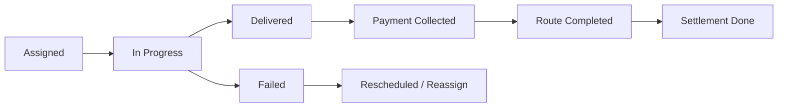

# Fresh Mandi Delivery App - Architecture

## Flutter Folder Structure
- `lib/core`: constants, network, theme, secure storage, firebase bootstrap, session timeout
- `lib/features/auth`: mobile + OTP login
- `lib/features/dashboard`: assigned route dashboard
- `lib/features/orders`: route order list/details + scan + payment/failure actions
- `lib/features/collection`: daily settlement summary
- `lib/features/route`: assigned/start/complete route APIs
- `lib/features/sync`: offline queue using SQLite
- `lib/shared/providers`: provider-based state management
- `lib/routing`: entry routing

```
lib/
  core/
    constants/
    network/
    storage/
    theme/
    utils/
  features/
    auth/
    dashboard/
    route/
    orders/
    collection/
    sync/
  shared/
    providers/
    widgets/
  routing/
```

## Screen-wise UI Design
- Login: mobile number input + OTP request CTA
- OTP: 6-digit OTP verification + retry entry
- Dashboard: rider profile, route card, KPI cards, start/complete route actions
- Route Orders: sequence list, status chip colors, search by name/flat
- Order Details: address + call + map, scan, delivery result, payment collection
- Collection Summary: cash/UPI/online/pending totals + handover confirmation

## State Management
- Provider / ChangeNotifier architecture
- `AuthProvider`: login/session/device binding context
- `DeliveryProvider`: route/orders lifecycle + mutation actions

## API Integration Logic
Expected backend endpoints:
- `POST /login`
- `POST /verify-otp`
- `GET /assigned-route`
- `POST /start-route`
- `GET /route-orders`
- `POST /scan-order`
- `POST /mark-delivered`
- `POST /mark-failed`
- `POST /collect-payment`
- `POST /complete-route`
- `GET /daily-summary`

All calls are JWT authenticated via Dio interceptor.

## Database Design (Delivery)
Table fields:
- `id`
- `route_id`
- `delivery_boy_id`
- `order_id`
- `delivery_status`
- `delivered_at`
- `failure_reason`
- `payment_status`
- `payment_mode`
- `payment_collected_at`
- `route_start_time`
- `route_end_time`

## Route Lifecycle
Assigned -> In Progress -> Delivered/Failed -> Payment Collected -> Completed -> Settlement Done



## Offline Sync
- Failed operations are queued to SQLite (`delivery_sync.db`)
- Queue schema: endpoint + payload + created_at
- Sync worker can replay queue on connectivity restoration
- Suggested sync loop:
  - Check connectivity
  - Pick oldest pending event
  - POST to API
  - On success delete queue row
  - On failure keep queued for retry with backoff

## Error Handling
- API errors surfaced via user-friendly snackbar/text
- Offline fallback queues critical updates
- Route ownership validation delegated to backend
- Mandatory backend guards:
  - delivery boy owns route
  - order belongs to assigned route
  - disallow duplicate completion updates

## Security Best Practices
- JWT in secure storage
- Inactivity auto logout
- OTP bypass controlled by `.env` for non-production only
- One-device binding included in login payload (`device_id`)
- Firebase push setup ready for route/event notifications
- Android screenshot protection enabled using `FLAG_SECURE`

## Scalability Notes
- 100+ orders list optimized with lightweight cards and local filtering
- All mutations done endpoint-first and stateless
- Offline queue minimizes data loss in weak network zones
